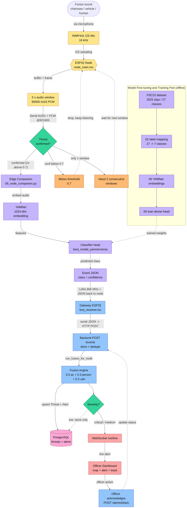

# Van-Chetna (Forest Guard) — Flow chart of the model

The full pipeline, laid out in three labeled stages (Sensing / Audio, Edge AI + Model
Training, Backend Fusion + Response). Node colors group related concerns and arrow labels
describe what data moves between parts.

Stage legend:

- Yellow = Sensing / Audio part (mic to framed window)
- Green = Decision gates (threat confirmation, severity routing)
- Purple = Edge AI + model training (YAMNet, classifier head, offline training)
- Blue = Backend fusion and API
- Red = Alerting / dashboard
- Pink = Data store
